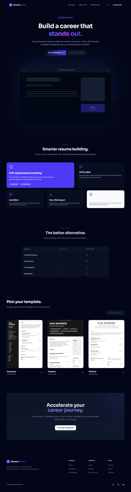
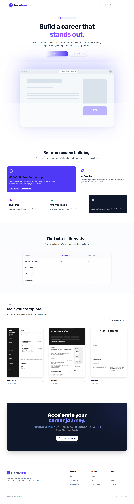

# ResumeBuilder 2.0 🚀

A world-class, open-source, and unlimited Resume Builder Web App. Redesigned with a premium SaaS aesthetic (Stripe/Linear style), featuring a high-performance editor, AI-powered content generation, and pixel-perfect templates.

![Landing Preview]

| Dark Theme                                       | Light Theme                                        |
| ------------------------------------------------ | -------------------------------------------------- |
|  |  |

## ✨ Features

- **💎 World-Class UI/UX:** Stunning SaaS-style design featuring glassmorphism, bento-grid layouts, smooth Framer Motion animations, and noise-textured backgrounds.
- **🌓 Global Theme Engine:** Centralized Dark/Light mode switcher on the landing page that intelligently scales across the entire application.
- **📊 User Dashboard:** Sophisticated workspace to manage multiple professional profiles with compact, interactive resume cards.
- **📝 Section Management:** Granular control over visibility. Toggle Projects, Certifications, and Languages, or create limitless Custom Sections.
- **🔐 Secure Auth:** Enterprise-grade JWT authentication with persistent, encrypted sessions.
- **⚡ Pro-Stream Editor:** Real-time, zero-latency feedback engine with integrated A4 preview and high-fidelity progress tracking.
- **🎨 Elite Theme System:**
  - **8+ Professional Palettes:** Instantly switch between Modern, Minimal, and Corporate categories.
  - **Visual Control:** Adjust margins, line heights, font sizes, and fonts (Inter, Sora, JetBrains Mono) with instant persistence.
- **🧠 AI Resume Co-pilot:**
  - **Mistral-Powered:** Generate high-impact summaries and achievement-oriented bullet points.
  - **ATS Scan:** Intelligent keyword analysis to ensure your resume survives the "black hole" of recruitment software.
- **📚 9+ Specialized Templates:** Precision-engineered designs optimized for visibility and high-contrast readability (Modern, Swiss Minimal, Executive, Technologist).
- **📄 Vector PDF Export:** High-resolution, one-click PDF generation that ensures what you see is exactly what the recruiter gets.

## 🛠️ Tech Stack

- **Frontend:** React 18, Vite, Tailwind CSS 4, Framer Motion, Zustand, Axios, Lucide React.
- **Backend:** Node.js, Express, MongoDB (Mongoose).
- **AI Engine:** OpenRouter (Mistral-Instruct) proxied via secure backend routes.
- **Export:** `react-to-print` for client-side professional rendering.

## 📁 Project Structure

```text
/resume-builder
  /backend     - Node.js API, MongoDB Models, JWT Auth, AI Proxy
  /frontend    - React SPA, Dashboard, Pro-Editor, Template Engine
  /docs        - Architectural docs and visual assets
```

## 🚀 Getting Started

### Setup

1. **Clone & Install:**
   ```bash
   npm install # in both /backend and /frontend
   ```
2. **Environment:**
   - **Backend:** Add `OPENROUTER_API_KEY`, `MONGODB_URI`, `JWT_SECRET` to `backend/.env`.
   - **Frontend:** Add `VITE_API_URL` to `frontend/.env`.
3. **Run:**
   ```bash
   # Backend
   cd backend && npm run dev
   # Frontend
   cd frontend && npm run dev
   ```

## 📈 Roadmap

- [x] Phase 1-15: Core Infrastructure & AI Integration
- [x] Phase 16: **World-Class UI Redesign** (Stripe/Linear Aesthetics)
- [x] Phase 17: **Global Persistence & Accessibility Fixes**
- [ ] Phase 18: Public Sharing & Read-only Shareable Links (Next)
- [ ] Phase 19: Cover Letter Generator & Job Board Integration

---

Built with absolute precision for the modern workforce.
